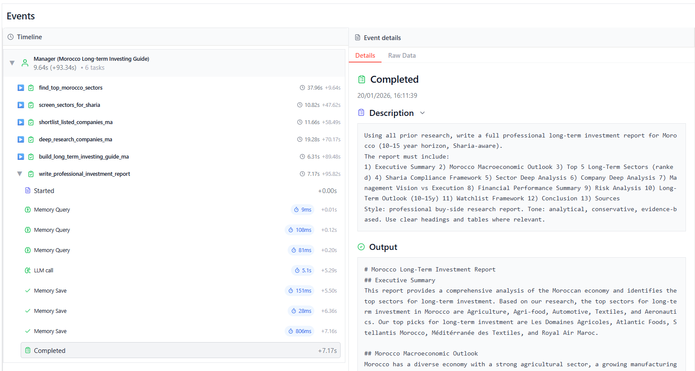

# 🤖 Morocco Long-Term Sharia-Aware Investing Guide

This repository implements a **multi-agent research pipeline** that produces:
- A ranked list of Morocco’s top long-term sectors (10–15y horizon)
- Sharia screening by business activity (conservative, activity-based)
- A shortlist of Moroccan **listed** companies (Bourse de Casablanca)
- Deep, source-driven research briefs per company
- A practical personal investing guide + a professional buy-side style report (Markdown)

> **Not financial advice.** This is an AI-assisted research workflow to help you structure due diligence and long-term thinking.

## Architecture

### Multi-Agent Research Pipeline (Hierarchical Crew)

This project implements a **hierarchical multi-agent pipeline** to produce a Morocco-focused, long-term (10–15y) investing guide that is **Sharia-aware by business activity**.

- **Stage 1 (Macro → Compliance):** identify durable Morocco sectors, then validate Sharia compliance (activity-based).
- **Stage 2 (Equities → Synthesis):** shortlist listed companies, perform deep research, then produce a personal guide + a professional report.

```
┌──────────────────────────────────────────────────────────────────────────────┐
│            MOROCCO LONG-TERM SHARIA-AWARE INVESTING GUIDE (PIPELINE)         │
└───────────────────────────────┬──────────────────────────────────────────────┘
                                │
                      ┌─────────▼─────────┐
                      │  Manager Agent    │
                      │ (hierarchical)    │
                      │ • Orchestrates    │
                      │ • Enforces rigor  │
                      │ • Avoids repeats  │
                      └─────────┬─────────┘
                                │
                ┌───────────────┼────────────────────────────────┐
                │               │                                │
        ┌───────▼────────┐  ┌───▼───────────────────┐   ┌────────▼──────────┐
        │ Macro Sector   │  │ Sharia Screening      │   │ Equity Research   │
        │ Strategist     │  │ Analyst (activity)    │   │ (deep research)   │
        │ • Rank sectors │  │ • Approve/flag        │   │ • Company briefs  │
        │ • Drivers/risks│  │ • Explain uncertainty │   │ • 5–10y trends    │
        └───────┬────────┘  └───┬───────────────────┘   └────────┬──────────┘
                │               │                                │
                ▼               ▼                                ▼
   output/morocco_top_sectors.json    output/sharia_approved_sectors.json
                                                   │
                                                   ▼
                                     output/shortlisted_companies.json
                                                   │
                                                   ▼
                                     output/company_deep_research.json
                                                   │
                         ┌─────────────────────────┴─────────────────────────┐
                         │                                                   │
                 ┌───────▼──────────────┐                     ┌──────────────▼──────────────┐
                 │ Portfolio Guide      │                     │ Investment Report Writer    │
                 │ Writer               │                     │ (buy-side style)            │
                 │ • Watchlist framework│                     │ • Full report (Markdown)    │
                 │ • DD checklist       │                     │ • Structured sections       │
                 └─────────┬────────────┘                     └──────────────┬──────────────┘
                           │                                                 │
                           ▼                                                 ▼
          output/morocco_investing_guide.md         output/Morocco_Long_Term_Investment_Report.md
```

---

## Project Structure

```
personal_stock_investment_guide/
│
├── pyproject.toml                         # Project config (uv + dependencies + scripts)
├── README.md                              # Main documentation
├── .env                                   # API keys & local embedding config (DO NOT COMMIT)
├── .gitignore                             # Excludes .env, caches, outputs if needed
│
├── src/
│   └── personal_stock_investment_guide/
│       ├── main.py                        # Entry point (kickoff inputs: Morocco, horizon, constraints)
│       ├── crew.py                        # Crew definition (agents, tasks, manager, memory, embedder)
│       └── config/
│           ├── agents.yaml                # Agent roles + LLM mapping (Groq-hosted models)
│           └── tasks.yaml                 # Task chain + output files
│
├── output/                                # Auto-generated deliverables
│   ├── morocco_top_sectors.json
│   ├── sharia_approved_sectors.json
│   ├── shortlisted_companies.json
│   ├── company_deep_research.json
│   ├── morocco_investing_guide.md
│   └── Morocco_Long_Term_Investment_Report.md
│
└── memory/                                # Local long-term memory store (SQLite) + crew memory artifacts
    └── long_term_memory_storage.db
```


## What It Generates (Outputs)

When you run the crew, the pipeline writes results into `output/`:

- `output/morocco_top_sectors.json`  
- `output/sharia_approved_sectors.json`  
- `output/shortlisted_companies.json`  
- `output/company_deep_research.json`  
- `output/morocco_investing_guide.md`  
- `output/Morocco_Long_Term_Investment_Report.md`  


## Installation & Configuration

Ensure you have Python >=3.10 <3.14 installed on your system. This project uses [UV](https://docs.astral.sh/uv/) for dependency management and package handling, offering a seamless setup and execution experience.

### 1) Prerequisites
- Python **>=3.10 <3.14**
- `uv` installed
- **Ollama** installed and running (for embeddings), plus the embedding model pulled:
  ```bash
  ollama pull nomic-embed-text
  ```

### 2) Install Python dependencies

From the project root:

```bash
uv sync
```

(Optional) Lock the dependencies and install them by using the CLI command:

```bash
crewai install
```

### 3) Install Ollama (required for embeddings)

This project uses **Ollama** locally for embeddings (vectorization) because the default hosted OpenAI embedder imposes quotas. Install Ollama from:

```text
https://ollama.com/download
```

Make sure it’s running (Ollama runs a local server on `http://localhost:11434`).

### 4) Pull an embedding model (pick ONE)

Recommended default (good quality + widely used):

```bash
ollama pull nomic-embed-text
```

Other solid embedding options you can use instead:

```bash
ollama pull mxbai-embed-large
# or
ollama pull bge-m3
# or
ollama pull snowflake-arctic-embed
# or (newer multilingual line)
ollama pull snowflake-arctic-embed2
```

Verify the model is installed:

```bash
ollama list
```


### 6) Configure `.env`
Create a `.env` at the project root. Example:

```bash
# Embeddings (Ollama)
EMBEDDINGS_OLLAMA_MODEL_NAME=nomic-embed-text

# API keys for LLMs
GROQ_API_KEY=your_groq_key_here

# Web search
SERPER_API_KEY=your_serper_key_here
```

> Notes:
> - Make sure your `.env` matches the model you pulled: (If you pulled a different one, set it accordingly, e.g. `mxbai-embed-large`.)
> - This project uses **Groq** models in `agents.yaml`, so `OPENAI_API_KEY` is not required unless you switch models/tools.
> - Keep keys private. Add `.env` to `.gitignore`.


## Running the Project

To kickstart your crew of AI agents and begin task execution, run this from the root folder of your project:

```bash
$ crewai run
```

This command initializes the personal_stock_investment_guide Crew, assembling the agents and assigning them tasks as defined in your configuration.

This example, unmodified, will run the create a `report.md` file with the output of a research on LLMs in the root folder.

## Understanding Your Crew

The personal_stock_investment_guide Crew is composed of multiple AI agents, each with unique roles, goals, and tools. These agents collaborate on a series of tasks, defined in `config/tasks.yaml`, leveraging their collective skills to achieve complex objectives. The `config/agents.yaml` file outlines the capabilities and configurations of each agent in your crew.


### Agents (src/personal_stock_investment_guide/config/agents.yaml)

Your crew is configured with these roles (and the **specific Groq-hosted models** used). Model choices are intentional: **bigger models** handle macro reasoning + orchestration, **specialized models** handle rule-based screening, and a **very large model** is reserved for the heavy, source-grounded deep research step.

- **Morocco Macro & Sector Strategist** *(LLM: `groq/llama-3.3-70b-versatile`)*: ranks Morocco sectors using long-run structural drivers.  
  *Rationale:* strong high-level reasoning + synthesis for macro/sector narratives without being too slow.

- **Sharia Compliance & Business Activity Screener** *(LLM: `groq/qwen/qwen3-32b`)*: screens sectors/companies for Sharia compliance (activity-based), flags uncertainty.  
  *Rationale:* reliable structured analysis and careful classification for compliance-style filtering.

- **Senior Morocco Equity Researcher** *(LLM: `groq/openai/gpt-oss-120b`)*: deep fundamental research; prefers primary sources (annual reports/AMMC filings/investor decks).  
  *Rationale:* maximum depth for multi-document extraction + synthesis, and higher tolerance for long, source-driven briefs.

- **Personal Investment Guide Writer** *(LLM: `groq/meta-llama/llama-4-maverick-17b-128e-instruct`)*: synthesizes into actionable watchlist + due diligence checklist.  
  *Rationale:* strong writing + structured summarization to convert research into a practical guide.

- **Professional Investment Report Writer** *(LLM: `groq/meta-llama/llama-4-maverick-17b-128e-instruct`)*: produces a complete buy-side style report in Markdown.  
  *Rationale:* consistent tone, long-form coherence, and report-style formatting.

- **Manager** *(LLM: `groq/llama-3.3-70b-versatile`)*: coordinates the pipeline in a hierarchical process and enforces rigor (sources, assumptions, no repetition).  
  *Rationale:* dependable “big-picture” control model to keep the crew aligned and outputs consistent.


### Tasks / Pipeline (src/personal_stock_investment_guide/config/tasks.yaml)

The workflow is a strict dependency chain:

1. **find_top_morocco_sectors** → rank top 5 durable sectors (exclude haram sectors like banking/insurance)
2. **screen_sectors_for_sharia** → approve/flag sectors by business activity
3. **shortlist_listed_companies_ma** → 2–4 listed companies per approved sector (w/ tickers + sources)
4. **deep_research_companies_ma** → business model, governance, 5–10y trends, risks, “trust score” (source-backed)
5. **build_long_term_investing_guide_ma** → practical guide (KPIs, red flags, DD checklist, next steps)
6. **write_professional_investment_report** → full professional report in Markdown

### Tools Used

- **Web search**: `SerperDevTool` via `SERPER_API_KEY`
- **Memory**: enabled on agents + crew
- **Embeddings**: configured to use **Ollama** (`nomic-embed-text`) for the crew’s embedder


## Cost & Rate Limits (Groq / Serper)

### Groq pricing disclaimer
Groq is **pay-per-token** and pricing/rate-limits can change. Always check the official pages for the latest:
- Groq pricing / models: https://console.groq.com/docs/models	(see docs / pricing in the console)
- Serper pricing: https://serper.dev/	(2500 offered credits)

### Your rough run cost estimate (example)
You noted a rough estimate around **$0.10 per run** (depends heavily on: model choices and token usage).

### Example rate-limit (Developer plan) snapshot
These limits can change; treat this as a reference snapshot:

| Model | Requests/min | Requests/day | Tokens/min |
|---|---:|---:|---:|
| groq/compound | 200 | 20K | 200K |
| groq/compound-mini | 200 | 20K | 200K |
| llama-3.3-70b-versatile | 1K | 500K | 300K |
| meta-llama/llama-4-maverick-17b-128e-instruct | 1K | 500K | 300K |
| qwen/qwen3-32b | 1K | 500K | 300K |
| openai/gpt-oss-120b | 1K | 500K | 250K |


## Safety & Research Quality Notes

- Prefer primary sources for company claims:
  annual reports, AMMC filings, investor presentations, official press releases.
- If a company/sector is borderline (Sharia or business-model ambiguity), the screener should **flag** it rather than forcing a yes/no.
- Always verify critical decisions manually before investing.

## Tracing Screenshot:



---

## Author

**Creator:** Baddy Reda  
**Status:** UM6P Student | AI & Agents Enthusiast 
**Contact:** redabaddy@emines.um6p.ma
---

***Happy researching!***
